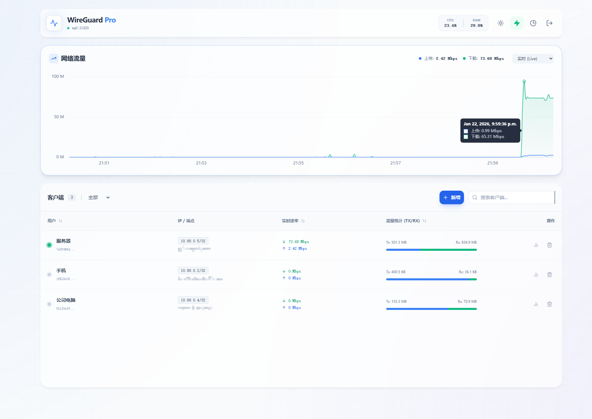

# ⚡ WireGuard Pro Dashboard

[](https://golang.org/doc/devel/release.html)

[](https://vuejs.org/)
[](https://tailwindcss.com/)

**极速 · 实时 · 现代化的 WireGuard 管理面板**

[特性介绍](#-核心特性) • [快速开始](#-快速部署) • [配置说明](#-配置参数) • [更新日志](#-更新指南-sse-版本)

---




</div>

## 📖 简介

**WireGuard Pro Dashboard** 是一个基于 Go 和 Vue.js 3 构建的高性能单文件管理面板。

与传统面板不同，它摒弃了低效的轮询机制，采用 **Server-Sent Events (SSE)** 技术实现毫秒级的数据推送。无论您有多少客户端，仪表盘都能以极低的资源占用，呈现如水流般丝滑的实时流量波形。

## ✨ 核心特性

### ⚡ 极致性能 (Real-Time Experience)
* **SSE 驱动**: 告别 `setInterval` 轮询，服务端仅在数据变动时主动推送。
* **零延迟感**: 配合 Chart.js 实时流式渲染，流量波形平滑无卡顿。
* **低负载**: 大幅减少无效 HTTP 请求，适合低配置 VPS 或嵌入式设备。

### 📊 深度可视化
* **实时监控**: 动态展示上传/下载速率、CPU 及内存负载。
* **历史回溯**: 支持查看 1小时 / 24小时 / 7天 的流量趋势。
* **流量画像**: 24小时活跃时段热力分布、Top 5 流量用户占比分析。

### 🛠 全能管理
* **客户端管理**: 一键创建/删除对等点 (Peer)，自动分配 IP。
* **配置分发**: 自动生成二维码 (QR Code) 供手机扫码，支持下载 `.conf` 文件。
* **别名备注**: 支持修改客户端别名，便于识别用户。

### 🧠 智能分析
* **健康评分**: 基于在线时长和活跃度，自动计算客户端健康分 (Health Score)。
* **足迹追踪**: 记录历史连接 IP，并自动解析地理位置（显示国家/地区旗帜）。

### 🔐 安全与便捷
* **单文件部署**: 编译后仅一个二进制文件，内置静态资源，无外部依赖。
* **数据本地化**: 使用嵌入式 SQLite 数据库，数据完全掌控。
* **JWT 鉴权**: 标准的 Token 认证机制，安全可靠。

## 🛠 技术栈

| 模块 | 技术选型 | 说明 |
| :--- | :--- | :--- |
| **Backend** | **Go (Golang)** | Gin 框架, Wgctrl, Gopsutil |
| **Frontend** | **Vue.js 3** | Composition API, 响应式设计 |
| **Styling** | **Tailwind CSS** | 现代化的原子类 CSS 框架 |
| **Charts** | **Chart.js** | 高性能 Canvas 图表库 |
| **Database** | **SQLite** | CGO-Free (modernc.org/sqlite) |

## 🚀 快速部署

### 1. 环境要求
* Linux 服务器 (Ubuntu/Debian/CentOS/Alpine)
* 已安装 WireGuard 内核模块 (`wg-quick`, `wg` 工具可用)
* Go 1.20+ (仅源码编译需要)

### 2. 编译安装

```bash
# 1. 克隆代码
git clone [https://github.com/yourusername/wg-dashboard.git](https://github.com/yourusername/wg-dashboard.git)
cd wg-dashboard

# 2. 编译 (生成的二进制文件包含所有静态资源)
go build -o wg-dashboard main.go

# 3. 运行 (需 root 权限以操作 wg 接口)
sudo ./wg-dashboard
```

> **提示**: 首次运行会自动在当前目录生成 `wg_stats.db` 数据库文件。

### 3. 访问面板

* **地址**: `http://<服务器IP>:8080`
* **默认密码**: `admin123`

## ⚙️ 配置参数

支持通过命令行参数自定义配置：

```bash
sudo ./wg-dashboard [参数...]

```

| 参数 | 默认值 | 描述 |
| --- | --- | --- |
| `-port` | `:8080` | Web 服务监听端口 |
| `-iface` | `wg0` | 监控的 WireGuard 接口名称 |
| `-password` | `admin123` | **(强烈建议修改)** 管理员登录密码 |
| `-db` | `./wg_stats.db` | SQLite 数据库存储路径 |
| `-days` | `30` | 历史流量统计数据保留天数 |
| `-secret` | `change_...` | JWT 签名密钥 (用于生成 Token) |

**生产环境示例:**

```bash
sudo ./wg-dashboard -port :80 -iface wg0 -password "MySecurePass!" -days 90

```

## 🔄 更新指南 (SSE 版本)

如果您是从旧版本（轮询版）升级，请注意以下变动：

1. **停止服务**: `pkill wg-dashboard`
2. **替换文件**: 更新 `main.go` 和 `index.html`。
3. **重新编译**: `go build -o wg-dashboard main.go`
4. **数据库迁移**: 程序启动时会自动检测并升级数据库表结构（添加 `endpoint` 字段），**无需手动操作**。
5. **重启服务**: 享受丝滑的实时体验！

## 📂 项目结构

```text
.
├── main.go              # Go 主程序 (API, SSE 广播, 定时任务)
├── index.html           # Vue3 前端入口 (通过 embed 嵌入 Go)
├── static/              # 静态资源目录
│   └── js/              # Vue, Tailwind, Chart.js 等依赖库
├── wg_stats.db          # SQLite 数据库 (自动生成)
└── README.md            # 项目文档

```

## 🤝 贡献与支持

欢迎提交 **Pull Request** 或 **Issue** 来改进这个项目！
如果你觉得这个项目对你有帮助，请给一个 ⭐️ **Star**！

## 📄 开源协议

基于  开源。

```

```
