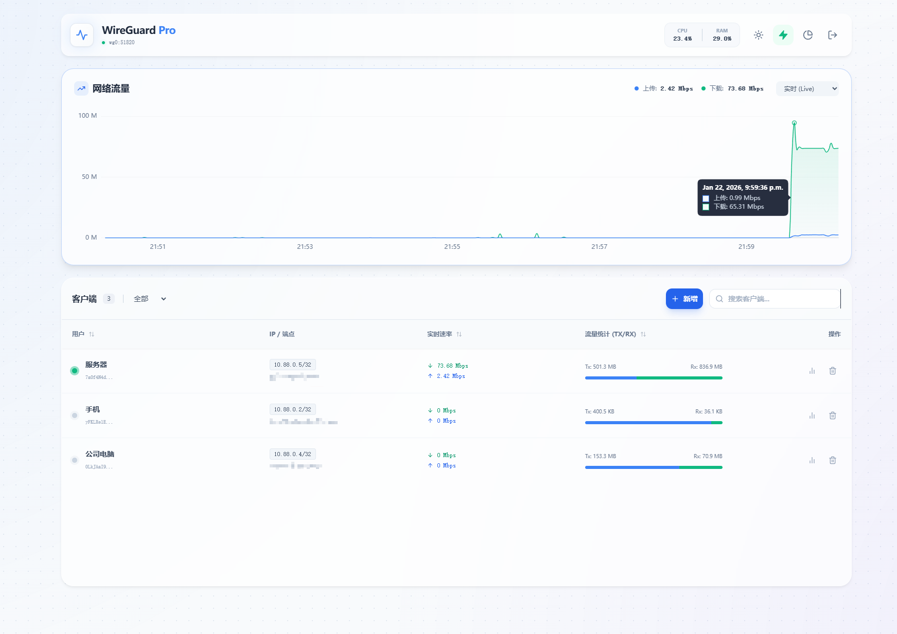

# 🛡️ WireGuard Monitor & Dashboard

一个轻量级、高性能的 WireGuard 流量监控与管理仪表盘。单二进制文件部署，集成了实时监控、历史流量回溯、设备管理与深度网络分析功能。

> **注意**: 本项目包含内嵌的前端 UI (`index.html`) 和高性能 Go 后端，无需复杂的环境依赖即可运行。

## ✨ 主要功能

* **📊 实时监控**: 秒级更新 WireGuard 接口的上传/下载速率，低延迟数据管道。
* **💾 历史回溯**: 基于 SQLite 存储历史流量数据，支持查看 1小时/24小时/7天 的流量趋势图。
* **📱 设备管理**:
* 自动发现 WireGuard 配置文件中的 Peer。
* 支持为 Peer 设置**别名 (Alias)**，方便识别。
* 在线/离线状态实时检测。


* **🩺 深度分析**: 提供 Peer 健康度评分、在线率统计、总流量排名以及 24小时活跃度热力画像。
* **🖥️ 系统概览**: 实时监控服务器 CPU、内存使用率、温度及负载情况。
* **🔐 安全认证**: 内置 JWT 身份验证机制，保护仪表盘访问安全。
* **🚀 零依赖**: 基于 `modernc.org/sqlite` (纯 Go 实现)，无需 CGO，跨平台部署极其简单。

## 📸 截图预览



## 🛠️ 安装与部署

### 前置要求

* Linux 操作系统 (需要访问 WireGuard 接口)
* 已安装并配置好的 WireGuard 接口 (如 `wg0`)
* Root 权限 (读取 wg 接口信息需要)

### 方法一：直接运行 (二进制)

1. **下载编译好的二进制文件** (参见 [Releases](https://www.google.com/search?q=%E4%BD%A0%E7%9A%84github%E9%93%BE%E6%8E%A5/releases) 页面) 或自行编译。
2. **运行**:
```bash
# 赋予执行权限
chmod +x wg-monitor

# 启动 (默认监听 8080 端口，监控 wg0)
sudo ./wg-monitor --password "your_secure_password"

```


### 方法二：Systemd 守护进程 (推荐)

创建服务文件 `/etc/systemd/system/wg-monitor.service`:

```ini
[Unit]
Description=WireGuard Monitor Dashboard
After=network.target wg-quick@wg0.service

[Service]
Type=simple
WorkingDirectory=/opt/wg-monitor
# 请修改下面的参数
ExecStart=/opt/wg-monitor/wg-monitor --iface wg0 --port :8080 --password "MySecretPass" --db /opt/wg-monitor/data.db
Restart=always
User=root

[Install]
WantedBy=multi-user.target

```

启动服务：

```bash
sudo systemctl daemon-reload
sudo systemctl enable --now wg-monitor

```

### 方法三：Docker 部署

*(如果您还没有创建 Dockerfile，可以在项目根目录创建如下 Dockerfile)*

```dockerfile
# Dockerfile 示例
FROM golang:1.21-alpine AS builder
WORKDIR /app
COPY . .
# 确保 index.html 存在
RUN go build -o wg-monitor -ldflags="-s -w" main.go

FROM alpine:latest
RUN apk add --no-cache tzdata wireguard-tools
WORKDIR /app
COPY --from=builder /app/wg-monitor .
CMD ["/app/wg-monitor", "--db", "/data/wg_stats.db", "--iface", "wg0"]

```

运行容器：

```bash
docker run -d \
  --name wg-monitor \
  --network host \
  --cap-add NET_ADMIN \
  -v /etc/wireguard:/etc/wireguard:ro \
  -v $(pwd)/data:/data \
  wg-monitor \
  --password "admin123"

```

*注意：由于需要直接访问宿主机网络接口，建议使用 `--network host` 模式。*

## ⚙️ 配置参数

所有配置均通过命令行参数传递：

| 参数 | 默认值 | 说明 |
| --- | --- | --- |
| `--iface` | `wg0` | 需监控的 WireGuard 接口名称 |
| `--port` | `:8080` | Web 服务监听地址和端口 |
| `--db` | `./wg_stats.db` | SQLite 数据库存储路径 |
| `--days` | `30` | 历史流量数据保留天数 |
| `--password` | `admin123` | 仪表盘登录密码 |
| `--secret` | `change_...` | JWT 签名密钥 (生产环境建议修改) |

示例：

```bash
./wg-monitor --iface wg1 --port :9090 --days 7 --password "StrongPass!"

```

## 🏗️ 开发与编译

本项目采用前后端分离开发，但在发布时通过 Go 的 `embed` 特性打包为单文件。

1. **准备环境**:
* Go 1.18+
* 确保 `index.html` (前端构建产物) 位于项目根目录。


2. **本地运行**:
```bash
# 需要 root 权限以读取 wg 接口
sudo go run main.go

```


3. **编译**:
```bash
# 编译为 Linux 可执行文件
CGO_ENABLED=0 GOOS=linux GOARCH=amd64 go build -o wg-monitor -ldflags="-s -w" main.go

```


## 📂 项目结构

```
.
├── main.go           # Go 后端核心逻辑 (采集、存储、API)
├── index.html        # 前端单页应用 (Vue3 + TailwindCSS)
├── go.mod            # Go 依赖定义
├── go.sum
└── README.md         # 说明文档

```

## 🔌 API 文档

后端提供 RESTful API，所有受保护接口需要在 Header 中携带 `Authorization: Bearer <token>`。

* `POST /api/login`: 获取 Token
* `GET /api/peers`: 获取所有 Peer 实时状态
* `GET /api/history/:publickey`: 获取指定 Peer 的历史流量
* `GET /api/chart/traffic`: 获取全局总流量趋势
* `GET /api/analysis`: 获取深度分析报告
* `POST /api/alias`: 设置 Peer 别名

## 🤝 贡献

欢迎提交 Issue 和 Pull Request！

1. Fork 本仓库
2. 创建您的特性分支 (`git checkout -b feature/AmazingFeature`)
3. 提交更改 (`git commit -m 'Add some AmazingFeature'`)
4. 推送到分支 (`git push origin feature/AmazingFeature`)
5. 开启一个 Pull Request

## 📄 许可证

本项目基于 MIT 许可证开源 - 详见 [LICENSE](https://www.google.com/search?q=LICENSE) 文件。

---

*Made with ❤️ by [Your Name]*